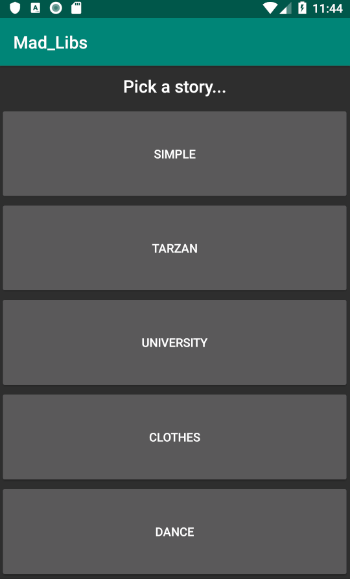
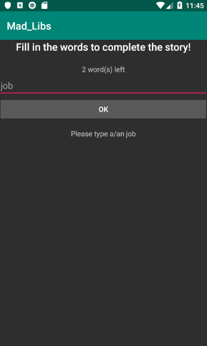

## Mad Libs (Android App)

*Anne Hoogerduijn Strating*
*12441163*

“Mad Libs” is a game containing short stories that have blanks called placeholders to be filled in by the user. In this app, the user 
is asked to fill in each of the placeholders without telling them anything about the overall story. Once all placeholders are 
filled in, the resulting silly story is shown.

